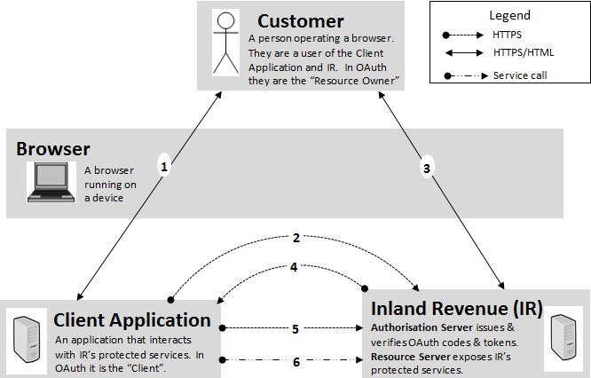
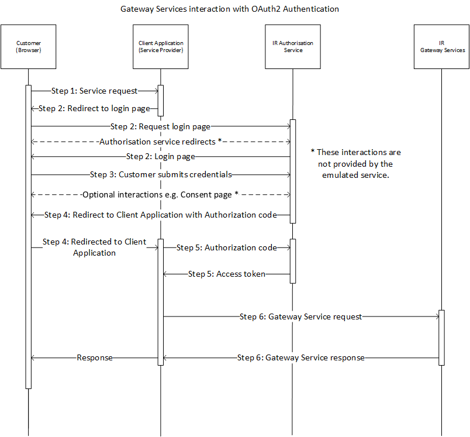

# OAuth Authentication - How to Integrate

#### Table of contents:

* [Simulating Authentication Flow](#simulating-authentication-flow)
* [Full Authentication Steps](#full-authentication-steps)
    * Step 1. Service Request  
    * Step 2. Request Authorisation Code
    * Step 3. Submit Login Credentials
    * Step 4. Redirect to Client Application
    * Step 5. Exchange Authorization Code for an Access Token
    * Step 6. Call the Gateway Service
* [Other OAuth Functionality](#Other-OAuth-Functionality)

### URL Authentication Endpoints:

 

>Note:
>
>The Onboarding Team will advise which Service Host Domain to use for OAuth during the testing development.

<a name="simulating-authentication-flow"/>

## Simulating Authentication Flow:
	
##### High Level Flow

	
##### Sequence Diagram


<a name="full-authentication-steps"/>

## Full Authentication Steps:

In our gateway services environments OAuth service is used, so as a service provider you would need to trigger customer's behaviour to complete this OAuth flow.

### Step 1. Service Request 
Customer accesses the Client Application via a web browser. They take an action that requires access to myIR Gateway Services.

### Step 2. Request Authorisation Code
The Client Application invokes the OAuth Server to get Authorisation code, the customer's browser is redirected to myIR login page. The service provider needs to send a ```HTTP GET``` request via the Browser request to OAuth Server. See [Authorisation Code Message Sample](Message%20Samples.md#RequestAuthorisationCode)

### Step 3. Submit Login Credentials
User submits myIR Usernname & Password and authorise consent via the user's web browser.

>Note: 
>
> The consent page and redirection pages are skipped in this mock environment (emulated service).

### Step 4. Redirect to Client Application
Authorization Code returns to Client Application by a ```HTTP 302 redirection``` to the ```{redirectURI}```. [Redirect Back to the  Application Message Sample](Message%20Samples.md#RedirectBacktotheApplication)

### Step 5. Exchange Authorization Code for an Access Token
Client Application retrieves OAuth Access Token by submitting a ```HTTP POST``` request using the Authorization Code as well as client application's credentials. See [Exchange Authorization Code for an Access Token Sample](Message%20Samples.md#ExchangeAuthorisationCodeforanAccessToken)

<a name="Call-the-API-Gateway-Service"/>

### Step 6. Call the Gateway Service

Once the Access Token has been obtained it can be used to make calls to the Gateway Service by passing it as a Bearer Token in the Authorization header of the ```HTTP POST``` request.

Access tokens are the thing that applications use to make Gateway Service requests on behalf of a user. The access token represents the authorization of a specific application to access specific parts of gateway service.

#### Request HTTP header and body: 
```http 
POST gateway/GWS/Returns/ HTTP/1.1
Host: {ServiceHostDomain}
Content-Type: application/soap+xml
Authorization: Bearer {AuthAccessToken}

<soap:Envelope xmlns:soap="http://www.w3.org/2003/05/soap-envelope">...</soap>
```

##### Native Desktop Application:
```php
curl --request POST \ 
  --url "https://{ServiceHostdomain}/gateway2/GWS/Returns/" 
  --header "Authorization: Bearer {AuthAccessToken}" 
  --header "Content-Type: application/soap+xml" 
  --data @prepoprequest.xml
```


##### Cloud Application (testing & production environments only):
```php
curl --request POST \ 
  --cert {PartnersCert} \ 
  --key {PartnersKey} \
  --url "https://{ServiceHostdomain}:4046/gateway/GWS/Returns/" \
  --header "Authorization: Bearer {AuthAccessToken}" 
  --header "Content-Type: application/soap+xml" 
  --data @prepoprequest.xml
```

Parameters:
* ```{PartnersCert}``` Client certificate file
* ```{PartnersKey}```  Private key file name
* ```{AuthAccessToken}``` Authorization Access Token is from Step 5. **Exchange Authorization Code for an Access Token**

>Note:
>
>* Access tokens must be kept confidential in transit and in storage. The only parties that should ever see the access token are the application itself, the authorization server, and resource server. The application should ensure the storage of the access token is not accessible to other applications on the same device. The access token can only be used over an https connection, since passing it over a non-encrypted channel would make it trivial for third parties to intercept.
>* The example cURL commands is just an example of consuming the prepop operation. Read the required Build Pack documentation for more information on consuming the required service.

<a name="Other-OAuth-Functionality"/>

## Other OAuth Functionality 

Other OAuth functionality includes:
* [Validate Access Token](Message%20Samples.md#ValidateAccessToken)
* [Request Refresh Token](Message%20Samples.md#RequestRefreshToken)
* [Revoke Access Token](Message%20Samples.md#RevokeTokenRequest)