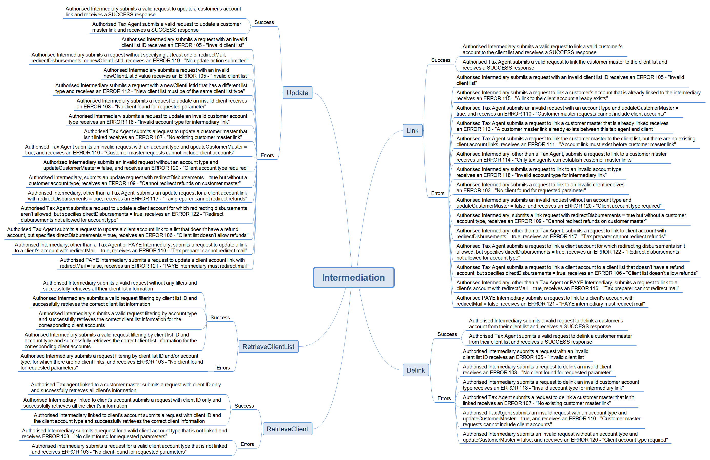

# Intermediation Service

#### Latest Release: v 2.2 30/04/20

Archives
* [V2.0 ](./Archive/20200402%20v2.01)
* [V1.0 ](./Archive/20180413%20v1.0)

## About the service

Intermediation is the process of linking a business intermediary (such as a tax agent, 
bookkeeper, payroll bureau, payroll intermediary etc) to an individual or organisation 
so the intermediary can act on their behalf for tax purposes. 

The Intermediation gateway service provides the ability for intermediaries to:
- manage links to clients (link, delink and update) 
- retrieve clients and client lists that are already established.

--------------------
## Latest updates

The following key changes have been made to the Intermediation service build pack

#### Build pack updates v 2.2 released 30/04/20
- section 2.3 Removed paragraph regarding XSD 'any' structure
- section 2.4 Paragraph added regarding updates to SOAP architecture
- section 3.2 Noted: It is worth noting that any existing EQU or ERA accounts will be automatically linked when linking to a client’s income tax account.
- section 4.3 Removed references to development WSDLs

#### Build pack updates v 2.1 released 11/03/20
- section 1.4 Note added to table of TLS requirements: " The same certificate cannot be used for the Test and Production environments.
- section 2.4 Information regarding TLS1.3 added
- new section 2.6 added for Delegated authority
- sections 3.1, 3.4 Added “All links returned by this operation will be active links but the account they are linked to may be ceased.”
- section 2.7 New section added: Active account types RDI and RUL

--------------------
## Key documentation

- Schemas and WSDLs
	- View and download the [Common v2 xsd](../Common%20XSD/Common.v2.xsd)
	- View and download the [Intermediation v1 xsd](Intermediation.v1.xsd)
	- View and download the [Intermediation v1 developer wsdl](IntermediationDevWsdl.v1.wsdl)
	
- Build pack
	- [Download the intermediation service build pack](Gateway%20Services%20Build%20Pack%20-%20Intermediation%20Service.pdf) to view data definitions of each operation and response status code definitions.
	
* Message samples
	* [View message samples for requests and positive responses](#Message-samples)

## Environment information

- [Mock environment information](#Mock-environment-information)
- [Test environment information](#Test-environment-information)
- [Production environment information](#Production-environment-information)

## Supporting services

* Service: Identity and Access - view [How to integrate, OAuth requests and responses message sample and build pack](../Identity%20and%20Access/)
* Service: [Software intermediation](../Service%20-%20Software%20Intermediation/)

------
## Message samples

* RetrieveClient
	* [RetrieveClient Request](sample%20messages/RetrieveClient-request.xml)
	* [RetrieveClient Response](sample%20messages/RetrieveClient-response.xml)

* RetrieveClientList
	* [RetrieveClientList Request](sample%20messages/RetriveClientList-request.xml)
	* [RetrieveClientList Response](sample%20messages/RetriveClientList-response.xml)

* Link
	* [Link Request](sample%20messages/Link-request.xml)
	* [Link Response](sample%20messages/Link-response.xml)

* Delink
	* [Delink Request](sample%20messages/Delink-request.xml)
	* [Delink Response](sample%20messages/Delink-response.xml)

* Update
	* [Update Request](sample%20messages/Update-request.xml)
	* [Update Response](sample%20messages/Update-response.xml)

-----------------
## Mock environment information:

* Mock emulated services URL
	* https://mock-int.ird.digitalpartner.services/

* Test scenarios
	- Intermediation Information Test Scenarios Mindmap
	

* Test data
	* The following test data can be tested in our Mock Services environment when submitting requests to the service operations.
	* This table shows which scenarios (as per their numbers in the mindmap) require specific data to trigger the expected responses.

> The following intermediary, client lists and linked clients are provided by the emulated service:

| *Intermediary id* | *Client list type* | *List id* | *List id type* | *Refund Account* | *Client Id* | *Linked* |
| --- | --- | --- | --- | --- | --- | --- | 
|132261132|Tax Agent|132261132|LSTID|No|132260737|AIL,AIP,EMP,FAM,FBT,GSD,GST,INC,IPS,NRT,REB,RLT,RWT,SLS|
| |Tax Agent|132261555|LSTID|Yes|132260818|AIL,AIP,DWT,EMP,FBT,GMD,GSD,GST,INC,IPS,MPO,NRT,PIE,RLT,RWT|
| | | | | | 132260806|REB|
| | Tax Agent|132261571|LSTID|Yes|132260753|master,GST,INC|
| | | | | | 132260774|EMP|
| | | | | | 132260806|FBT|
| | Tax Agent|132261660|LSTID|No|083230304|GST|
| | | | | | 132293525| CRS,FAT |
| | | | | |085078534 | PRS | 077415807 | EMP |
| | PAYE Intermediary | 132280722 | LSTID | No | 077415807 | EMP |
| | | | | | 132260753 | EMP |
| | | | | | 132260806 | EMP |
| | Bookkeeper | 1039039 | CLTLID | No | 077415807 | EMP |
| | | | | | 132260806 | INC | 
| | Other Representative | 1089042 | CLTLID | No | 077415807 | EMP |
| | | | | | 132260806 | NRT | 
| | Payroll Bureau | 1039040 | CLTLID | No | 077415807 | EMP |
| | | | | | 132260806| EMP |	

> The following clients are defined by the emulated service but are not linked:

| *Client id* | *Client account types* |
| --- | --- | 
| 132260753| AIL,AIP,FBT,GSD,IPS,NRT,REB,RLT,RWT |
| 132260958 | AIL,AIP,DWT,EMP,FBT,GMD,GSD,INC,IPS,MPO,NRT,PIE,RLT,RWT |
| 132269289 | AIL,AIP,EMP,FAM,FBT,GSD,GST,INC,IPS,NRT,REB,RWT,SLS |

-----------------
## Test environment information:

* Test scenarios
	- [Download test scenarios report template](Intermediation%20Service%20-%20Test%20Scenarios%20Report%20Template.docx)

* Test environment URL endpoints

	* Cloud gateway service: https://test3.services.ird.govt.nz:4046/gateway/gws/intermediation/
	* Native desktop gateway Service: https://test3.services.ird.govt.nz/gateway2/gws/intermediation/
	* Cloud SOAP WSDL: https://test3.services.ird.govt.nz:4046/gateway/gws/intermediation/?wsdl
	* Native desktop SOAP WSDL: https://test3.services.ird.govt.nz/gateway2/gws/intermediation/?wsdl

-----------------
## Production environment information:

* Production URL endpoints

	- Cloud gateway service: https://services.ird.govt.nz:4046/gateway/gws/intermediation/
	- Native desktop gateway service: https://services.ird.govt.nz/gateway2/gws/intermediation/
	- Cloud SOAP WSDL: https://services.ird.govt.nz:4046/gateway/gws/intermediation/?wsdl
	- Native desktop SOAP WSDL: https://services.ird.govt.nz/gateway2/gws/intermediation/?wsdl